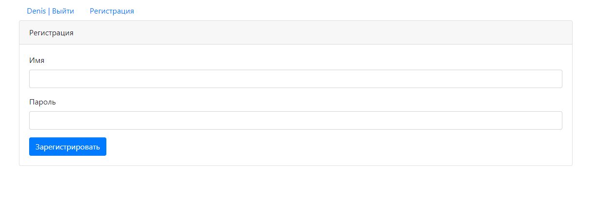
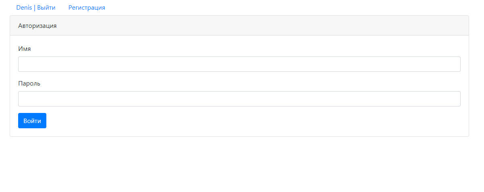
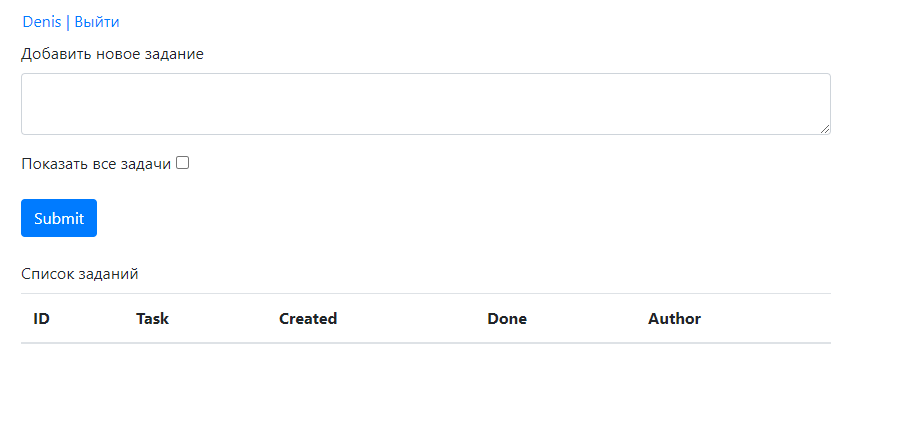
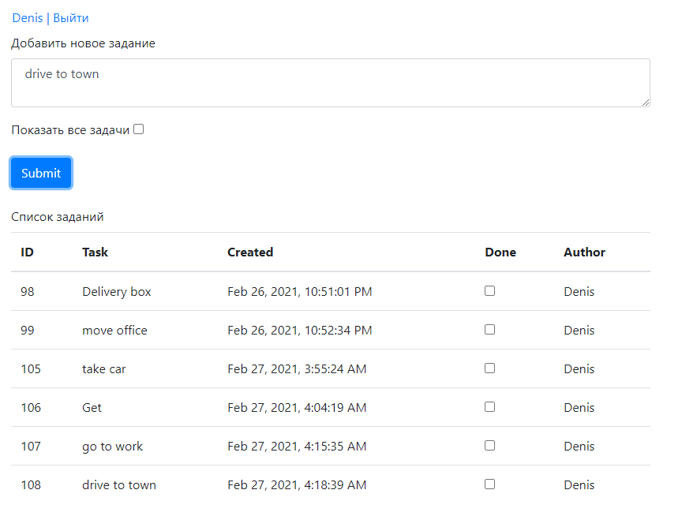
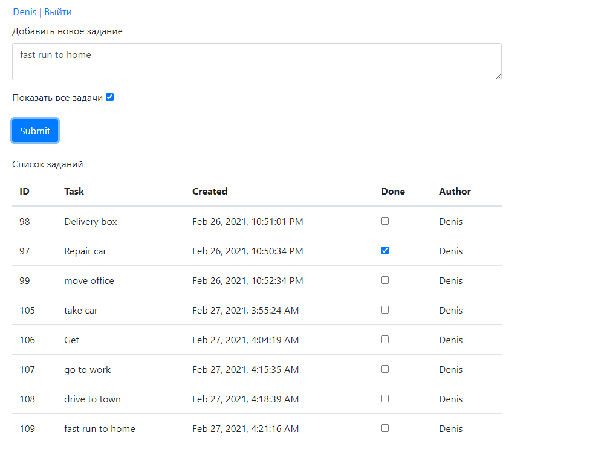

  
ToDoList 
Проект представляет собой простой менеджер задач. 
Функционал проекта: 
 - регистрация;
 - авторизация;
 - добавление задач с учетом автора;
 - вывод списка всех задач;
 - вывод только нерешенных задач. 
 
 Используемые технологии:
  - servlets; 
  - JSP; 
  - simple HTML/JS(JQueue|Ajax)/CSS; 
  - JDBC; 
  - postgres SQL; 
  - apache Tomcat; 
  - OOP; 
  - maven as a build system; 
  - hibernate. 
  
  Скриншоты интерфейса
  

Регистрация

Авторизация

Проверка имени пользователя и пароля

Страница менеджера задач

Добавление и вывод списка нерешенных задач

Добавление и вывод списка всех задач